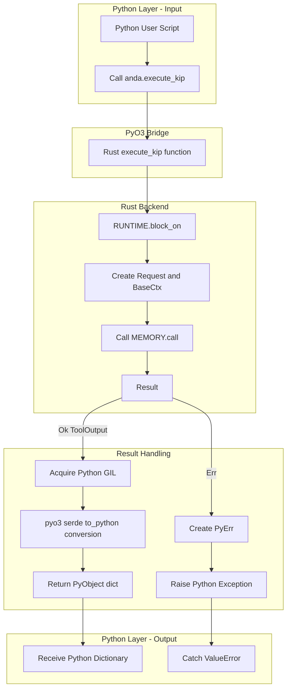
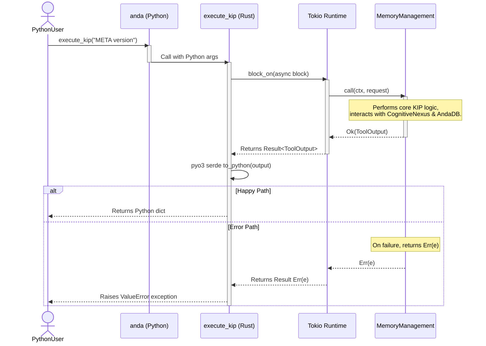

# Anda DB Python Bindings Architecture

This document contains Mermaid.js diagrams visualizing the architecture and operational flow of the Anda DB Python bindings.

## 1. High-Level Workflow

This flowchart shows the end-to-end process of a function call from Python to the Rust backend and back.

## 2. Detailed Sequence Diagram

This diagram illustrates the specific interactions and lifecycle of objects during a single `execute_kip` call.

